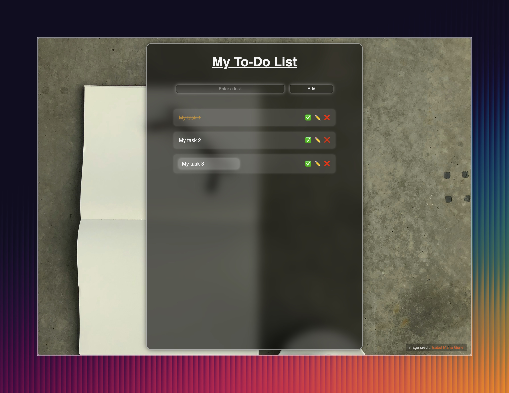

# 📝 To-Do App

A simple and stylish To-Do List web application built with HTML, CSS, and JavaScript.

## 🚀 Features

- Add tasks by clicking the button or pressing Enter
- Delete tasks individually
- Automatically saves in-progress input temporarily with `sessionStorage`
- Fully responsive and mobile-friendly design
- Clean and modern UI using Flexbox and custom CSS effects

## 🧠 Technologies Used

- HTML5
- CSS3 (Flexbox, Responsive Design)
- JavaScript (DOM manipulation, Events, sessionStorage)

## 📁 Project Structure

```
/To-Do-App
├── index.html         # Main HTML file
├── style.css          # Styling for the app
├── script.js          # JavaScript logic
└── README.md          # Project description
```

## 🛠️ Future Enhancements

- Firebase integration for user authentication and task storage
- Dark mode toggle
- Edit and reorder tasks
- User accounts and data syncing

## 🌐 Live Demo

Coming soon via GitHub Pages!

## 📸 Preview



## 🌟 Planned Features (Future Roadmap)
	•	Firebase Integration
	•	Realtime database connection for storing tasks permanently
	•	Firebase Authentication to support individual user accounts
	•	Secure cloud sync across devices
	•	Task Editing
	•	Ability to edit existing tasks without deleting and recreating them
	•	Task Reordering
	•	Drag-and-drop or up/down buttons to reorder tasks based on priority
	•	Task Completion Tracking
	•	Mark tasks as completed with visual distinction (e.g., strike-through, color change)
	•	Optional “Hide completed” toggle
	•	Dark Mode Support
	•	Toggle between light and dark themes
	•	Save user preference in localStorage
	•	Accessibility Improvements
	•	ARIA labels and keyboard navigation support
	•	Enhanced screen reader compatibility
	•	Progressive Web App (PWA)
	•	Installable app with offline capabilities
	•	Splash screen and app icon
	•	Multi-language Support (i18n)
	•	Interface translations (starting with English and Turkish)

## 👤 Author

Developed by Semih Çetin  
GitHub: [@oksimveiti](https://github.com/oksimveiti)